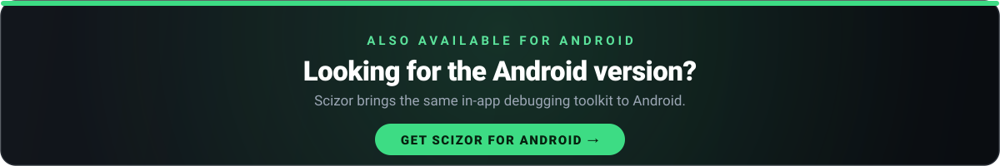

<a href="https://github.com/bstillitano/scizor"></a>

<p align="center">
  
</p>

# Scyther

[](https://github.com/bstillitano/Scyther/actions/workflows/ci.yml)
[](https://scyther.io/documentation/scyther)   

A comprehensive iOS debugging toolkit that helps you cut through bugs in your iOS app. Scyther provides tools for developers, QA testers, UI/UX teams, and backend developers. Made with love in Sydney, Australia.

## Table of Contents

- [Features](#features)
- [Requirements](#requirements)
- [Preferences Storage](#preferences-storage)
- [Installation](#installation)
- [Quick Start](#quick-start)
- [Detailed Usage Guide](#detailed-usage-guide)
  - [Feature Flags](#feature-flags)
  - [Server Configuration](#server-configuration)
  - [Network Logging](#network-logging)
  - [Traffic Stats](#traffic-stats)
  - [Request Overrides](#request-overrides)
  - [Scyther's Own Traffic](#scythers-own-traffic)
  - [Request Replay](#request-replay)
  - [Breakpoints](#breakpoints)
  - [Network Conditioning](#network-conditioning)
  - [Console Logging](#console-logging)
  - [Crash Logging](#crash-logging)
  - [Database Browser](#database-browser)
  - [Data Browsers](#data-browsers)
  - [Location Spoofing](#location-spoofing)
  - [Push Notification Testing](#push-notification-testing)
  - [UI Debugging Tools](#ui-debugging-tools)
  - [Custom Developer Options](#custom-developer-options)
  - [Environment Variables](#environment-variables)
- [Menu Invocation](#menu-invocation)
  - [Pinning menu items](#pinning-menu-items)
  - [Menu language](#menu-language)
- [API Reference](#api-reference)
- [FAQ](#faq)
- [Contributing](#contributing)
- [License](#license)

## Features

### Device & Application Info
- Display device model, OS version, and hardware details
- Show bundle identifier, app version, and build number
- Display process ID and release type (Debug/TestFlight/App Store)
- Show build date and app ID prefix

### Networking
- **Network Logging**: Automatically intercept and log all HTTP requests/responses
- **Request Details**: View headers, body, timing, and response codes
- **cURL Export**: Generate cURL commands for any captured request
- **Log Export**: Share the captured requests as a zip containing a HAR 1.2 file, raw bodies, and a cURL command per request, with best-effort redaction and a sensitivity warning
- **Filter Chips**: Narrow the network log by method, status class, host, content type, API kind, GraphQL operation, duration, exact status code, or recency from glass chips pinned above the list, or edit every filter at once from the all-filters sheet
- **Traffic Stats**: A chart button on Network Logs opens the figures for whatever the list is showing — failure rate, median and 95th percentile duration, bytes received, the slowest endpoints, a per-host breakdown, and a waterfall overview strip compressing the whole log onto one shared axis — tap it to open **See all** centred on the moment touched, or use the header link to open it anchored on the newest traffic at half the log's span (the whole span instead, on a log short enough that the two are the same thing) — where the same strip now carries a zoomable, draggable window over a detail list: pinch to zoom, drag the strip to move the window, an accessibility-adjustable action for VoiceOver and Switch Control, and a tappable row per request that opens its details — tapping the strip itself never does, there it only moves the window
- **Request Overrides**: Mock responses, serve local files, rewrite headers, and add latency, throttling or random failures to matching requests — combined on one override — from the menu or from code
- **Save as Mock**: Turn any captured response into a disabled mock override in one tap, and import a HAR file as a whole set of them
- **Request Replay**: Reopen any captured request in an editor, change its method, URL, headers or body, and send it again — the resent request is logged with a `REPLAY` badge and listed on the original with its status, duration and size deltas
- **Breakpoints**: Hold a matching request before it is sent, or a matching response before the app sees it, edit method, URL, headers, status or body in place, then continue or fail it with an error of your choosing — every hold has a timeout, and none of it ever runs during a test
- **Network Conditioning**: Degrade every intercepted request at once — latency, a bandwidth ceiling and a failure rate, with the presets Network Link Conditioner made familiar
- **Server Configuration**: Switch between development, staging, and production environments
- **IP Address**: Display the device's public IP address

### Data Management
- **Feature Flags**: Register and override feature flags at runtime
- **UserDefaults Browser**: View and modify UserDefaults values
- **Cookie Browser**: Inspect and manage HTTP cookies
- **Keychain Browser**: View keychain items (read-only for security)
- **File Browser**: Browse app sandbox (Documents, Library, Caches, tmp)
- **Database Browser**: Browse SQLite, CoreData, and SwiftData databases with full CRUD support

### System Tools
- **Location Spoofing**: Fake GPS coordinates for testing location-based features
- **Preset Locations**: 20+ major cities worldwide
- **Custom Locations**: Set any coordinate manually
- **Route Simulation**: Simulate movement along predefined routes
- **Deep Link Tester**: Test custom URL schemes and universal links with QR scanner
- **Crash Logging**: Capture and view uncaught exceptions on subsequent app launches

### Notifications
- **Push Notification Tester**: Schedule local test notifications
- **Notification Logger**: View received notification payloads
- **Token Display**: View APNS and FCM device tokens

### UI/UX Tools
- **Grid Overlay**: Display alignment grid over your UI
- **FPS Counter**: Real-time frame rate overlay with color-coded performance indicators
- **Touch Visualizer**: Show touch points for demos and recordings
- **Accessibility Audit**: Walk the live accessibility tree for missing VoiceOver labels, undersized touch targets, and low-contrast text, with a live on-screen overlay for the two checks that cost nothing
- **View Frames**: Highlight view boundaries with colored borders
- **View Sizes**: Display view dimensions as labels
- **Slow Animations**: Reduce animation speed for debugging
- **Appearance Overrides**: Force dark/light mode, high contrast, and Dynamic Type sizes
- **Font Browser**: View all available system fonts
- **Interface Previews**: Browse registered UI components
- **Language**: Force the app's language from the debug menu (applies on next launch; Scyther's own menu switches immediately)
- **Pseudo-localisation**: Accent, lengthen, flip to RTL, or show catalog keys, to find layout problems before a translator is briefed — see [Pseudo-localisation](#pseudo-localisation) for exactly which strings it can and cannot reach, and when RTL takes effect

### Development Tools
- **Console Logger**: Capture and view stdout/stderr output
- **Custom Options**: Add your own debug options to the menu

## Requirements

- iOS 16.0+
- Xcode 16+
- Swift 6.0+

## Swift 6 Compatibility

Scyther is fully compatible with Swift 6 strict concurrency checking. The library uses modern Swift concurrency patterns throughout:

### Concurrency Architecture

| Component | Isolation | Notes |
|-----------|-----------|-------|
| `Scyther` | `@MainActor` | Main entry point, UI presentation |
| `Scyther.servers` | `actor` | Thread-safe server configuration |
| `NetworkLogger` | `actor` | Thread-safe request logging with `AsyncStream` |
| `Scyther.featureFlags` | `@MainActor` | Feature flag management |
| `Scyther.network` | `@MainActor` | Network facade |
| `Scyther.console` | `@MainActor` | Console capture facade |
| `Scyther.crashes` | `@MainActor` | Crash logging facade |
| `Scyther.interface` | `@MainActor` | UI tools facade |
| `Scyther.location` | `@MainActor` | Location spoofing facade |
| `Scyther.localization` | `@unchecked Sendable` | `LanguageOverride`, lock-guarded language override facade |

### Working with Actors

The `Servers` subsystem is an actor, requiring `await` for all access:

```swift
// Register servers (requires await)
await Scyther.servers.register(id: "dev", variables: ["API_URL": "https://dev.api.com"])

// Access current configuration (requires await)
let currentServer = await Scyther.servers.currentId
let apiURL = await Scyther.servers.variables["API_URL"]
```

### Sendable Conformance

Key public types conform to `Sendable` for safe cross-actor usage:

- `ServerConfiguration` - Server environment configuration
- `Location` - GPS coordinate data
- `Route` - Location simulation routes
- `ConsoleLogEntry` - Captured console output
- `CrashLogEntry` - Captured crash data

### Performance Optimizations

Scyther uses `nonisolated` properties for UserDefaults-backed settings to avoid actor hop overhead in hot paths. This ensures the debugging tools don't impact your app's UI performance.

### Localisation

Scyther's own interface is available in twelve languages besides English: French, German,
Spanish, Italian, Brazilian Portuguese, Dutch, Japanese, Simplified and Traditional Chinese,
Korean, Russian, and Arabic. It picks one the same way any app does — from the language the
user is running — so a developer on a French device opens a French debug menu without
configuring anything. Arabic lays the menu out right to left.

Every non-English string was machine-authored and is marked `needs_review` in the catalog
rather than `translated`. Treat them as a working draft until a native speaker has approved
them.

#### The Language page

**UI/UX → Language** lists your app's own localisations and switches between them, so a tester
can check a screen in Japanese without changing the device language or reinstalling.

The switch takes effect app-wide on the next launch, so the page offers to quit — **Later** or
**Quit App**, and Scyther never quits on its own. Scyther's menu switches immediately, which
means it can briefly be in a different language than the screen behind it. That is expected:
iOS reads the app's language once at launch, and no app can retranslate views already on
screen without restarting.

#### `Scyther.localization`

The override is also available programmatically, as `Scyther.localization` (`LanguageOverride`):

```swift
Scyther.localization.setPreferredLanguage("fr")  // forces French app-wide on next launch
Scyther.localization.preferredLanguage           // "fr", or nil for the device default
Scyther.localization.availableLanguages          // the host app's declared localisations
Scyther.localization.reset()                     // back to the device language
```

`Scyther.notifications.scheduleTest(title:body:delay:sound:incrementBadge:)` takes optional
`title` and `body`; omitting either (or passing `nil`) falls back to Scyther's own localised
sample notification copy instead of English placeholder text.

The example app at `Example/ScytherExample` ships its own
`Example/ScytherExample/Resources/Localizable.xcstrings`, so it is fully localised in the same
languages independently of the package's own catalog.

### Pseudo-localisation

**UI/UX → Pseudo-localisation** renders the interface with copy that behaves like a translation
without being one, to find layout problems before any translation exists. Four modes, all off by
default and all combinable:

| Mode | What it does | What it finds |
| --- | --- | --- |
| Accented | `Hello` becomes `Ĥéļļö` | Text still in plain ASCII was never localised |
| Lengthened | `[Hello··]`, about 135% of the original | Clipping and truncation |
| Right to Left | Mirrors the layout | Hard-coded leading/trailing assumptions |
| Show Keys | Renders `Selected %lld items` instead of `Selected 5 items` | Which catalog entry produced a piece of copy |

The brackets Lengthened adds are the point of it: a label missing its closing `]` was truncated,
which is easier to see than judging whether accented text looks a few characters short.

A fifth switch, **Show Boundaries**, decides whether those brackets are drawn, and it is the one
switch that ships **on**. The padding dots already say a string grew; only the closing bracket says
whether the end of it was cut off, which is the thing Lengthened exists to reveal — so the brackets
stay by default, and the switch is there for when you want the expansion without the punctuation.
It transforms nothing itself, so with every text mode off it does nothing at all.

#### What it reaches, and what it does not

Scyther's own interface is always transformed, because every string in the package is resolved
through `localized(_:)` and the transform sits in that path.

Your app is a different question, and the honest answer depends on how your code loads its
strings:

- **`NSLocalizedString` is reached.** It is a thin wrapper over
  `-[NSBundle localizedStringForKey:value:table:]`, an Objective-C method, which Scyther swizzles
  while a text mode is on. That covers UIKit apps, storyboard and XIB strings, and Swift code
  written the traditional way.
- **`String(localized:)`, `LocalizedStringResource` and SwiftUI's `Text("Some key")` are not
  reached.** This was measured, not assumed: with that method hooked, none of those paths ever
  reached the hook — including a `Text` rendered all the way to a bitmap with `ImageRenderer`.
  Foundation's Swift-native lookup does not go through `NSBundle` at all, and no other selector on
  the class sees them either.

So on a SwiftUI app whose copy is written as `Text("…")`, the three text modes pseudo-localise
Scyther's own menu and nothing else. That is a demonstration of the idea against a real localised
SwiftUI interface, not a test of your screens. On a UIKit or `NSLocalizedString`-based app it is a
test of your screens.

**Right to Left is a different mechanism, and it is a next-launch setting.** It changes no text, so
it does not care how your copy is loaded — and nothing at all happens in the session where you flick
the switch:

| Surface | When it mirrors | Checked on a device |
| --- | --- | --- |
| Your app's UIKit views | On its next launch | yes |
| Your app's SwiftUI views | On its next launch | yes |
| The Scyther menu and every page in it | On its next launch | yes |

Switching it **off** unwinds the same way: everything comes back left-to-right on the launch after
you switch it off. Both directions were checked on a device — relaunched with the keys present, and
relaunched with them absent.

Because nothing takes effect until then, the toggle raises the same **Relaunch required** alert the
Language page raises, with **Later** and **Quit App**. This is exactly how Xcode's own **Right to
Left Pseudolanguage** scheme option behaves.

Earlier versions mirrored Scyther's own menu the moment the switch moved. That is deliberately gone:
anything that changed mid-session disagreed with something that had not, and UIKit answers a
disagreement by mirroring text that has already been laid out — which draws it backwards, `Fonts` as
`stnoF`. Waiting for a relaunch is the price of never seeing that.

**How it works.** Scyther writes `AppleTextDirection` and
`NSForceRightToLeftWritingDirection` into your standard `UserDefaults` — the two keys Xcode's own
**Right to Left Pseudolanguage** scheme option passes on the command line, which iOS resolves
before any view exists and which reach UIKit and SwiftUI alike. It is the same move the Language
page already makes with `AppleLanguages`.

Switching the mode off **removes** both keys rather than setting them false, so your app goes back
to exactly the state it was in before Scyther was asked, on its next launch. Nothing is written on
an App Store build, and a stale key from a TestFlight build is cleared rather than kept.

An earlier version tried to mirror your app through `UIView.appearance()` instead. It is gone: the
appearance proxy stamps a view once, as the view joins a window, and never revisits it, so
switching the mode off could not undo the views it had already stamped — and a leftover stamp
disagreeing with SwiftUI's own layout direction makes UIKit mirror text that has already been laid
out, which renders it backwards (`Fonts` as `stnoF`). It also never reached a SwiftUI view at all.
The defaults keys do what it was reaching for, at the only moment it can be done properly.

#### Safety and limits

The rule Scyther holds itself to here is that it must never produce broken text that is not a
localisation problem. A mangled link or a plural that stops expanding is not a finding; it is a
defect the developer will spend an afternoon chasing in their own code.

- Off by default, persisted under `Scyther_pseudo_localization_*` in `UserDefaults.scyther`. Show
  Boundaries is the one exception: it reads as on when nothing has been stored for it, so an
  existing install behaves exactly as it did before the switch existed.
- The swizzle is installed only while a text mode is on and removed when the last one is switched
  off. An app that never opens the page never has its string loading touched.
- Only `Bundle.main` is transformed, so UIKit's own "Cancel" and "Done" are left alone — and
  within it, **only the default `Localizable` table**. A table your app named on purpose is left
  alone too, because teams routinely keep things there that are per-locale but are not copy:
  analytics identifiers, feature-flag names, segment keys. The cost is real and worth knowing: if
  your copy lives in a named table, the text modes will not reach it.
- **`.stringsdict` plurals are left alone entirely.** A plural format resolves to
  `%#@count@ items` carrying configuration that Foundation expands later; Scyther can preserve
  neither the variable name through accenting nor the attached configuration through any transform
  at all, so it returns the string Foundation produced, untouched, whatever the modes say. A plural
  label is therefore one of the few places pseudo-localisation shows nothing.
- Accenting preserves anything that is not copy: format specifiers (`%@`, `%lld`, `%1$@`, `%.2f`),
  `.stringsdict` variables (`%#@count@`), brace placeholders (`{name}`), and URLs and email
  addresses. `https://example.com` stays a working link rather than becoming
  `ĥţţþš://éẋåɱþļé.çöɱ`.
- Nothing is installed on an App Store build or under XCTest. That guard sits on the swizzle and on
  the defaults write themselves, not only on their caller, and an App Store build honours no
  persisted mode. The one thing an App Store build still does is *remove* a right-to-left key left
  behind by a TestFlight build, which is the safe direction to err in.
- The **text** of the Pseudo-localisation page and its menu row is never transformed, so the modes
  can always be switched off — there is a **Turn Everything Off** button, and a **Sample** row that
  shows what the modes do on the one page where they do not apply. Right to Left flips this page
  along with the rest of the app after a relaunch; the text stays legible, which is what the
  exemption is for.
- Right to Left applies on the next launch and nothing changes before then, in either direction;
  see the table above. It writes two keys into your app's standard `UserDefaults` to do it, and
  removes them when switched off. The toggle raises a **Relaunch required** alert so this is never
  a surprise.

#### Adding or correcting a translation

Strings live in per-module fragments under `Scripts/localization/strings/`, which
`Scripts/localization/build_catalog.py` merges into the shipped String Catalog. Edit the
fragment and re-run the generator rather than editing the catalog directly — CI regenerates
it and fails on any drift.

To add a string, call `localized("Your English text")` at the call site and add the key with
every supported language to that module's fragment. To add a language, list its code in the
generator's `LANGUAGES` and in `ScytherLocalization.supportedLanguages`, then fill in every
fragment. A test fails the suite if a SwiftUI literal bypasses `localized(_:)`, and another
fails if any key is missing a language.

## Preferences Storage

Scyther never writes to `UserDefaults.standard`. Every setting it persists — feature flag
overrides, pinned menu items, spoofed locations, grid overlay configuration, appearance
overrides and the rest — lives in a private suite named `com.scyther.settings`.

This matters because apps commonly clear their own defaults when a user signs out:

```swift
// Both of these wipe the application domain only.
UserDefaults.standard.dictionaryRepresentation().keys
    .forEach(UserDefaults.standard.removeObject(forKey:))

UserDefaults.standard.removePersistentDomain(forName: Bundle.main.bundleIdentifier!)
```

A named suite is a separate persistent domain, so neither call touches Scyther's state.
Your debugging setup survives sign-out.

The store is exposed if you need it directly:

```swift
UserDefaults.scyther.bool(forKey: "Scyther_grid_overlay_enabled")
```

### Migration from earlier versions

Versions before this change stored settings in `UserDefaults.standard`. The first time
Scyther's store is accessed it moves every key prefixed `scyther` (case-insensitive) out of
the standard store and into the suite, skipping any key the suite already has a value for,
then records that it has done so. Existing overrides and preferences carry across
automatically, and your app's standard domain is left cleaner than it was. This prefix match
is the one place migration touches data it did not write itself: a key your own app happens
to store under a `scyther`-prefixed name would also be moved.

You can inspect and edit the suite from **Data → UserDefaults**, using the store picker at
the top of the screen.

## Installation

### Swift Package Manager

Add Scyther to your `Package.swift`:

```swift
dependencies: [
    .package(url: "https://github.com/bstillitano/Scyther.git", branch: "main")
]
```

Or in Xcode:
1. Go to **File > Add Package Dependencies**
2. Enter the repository URL: `https://github.com/bstillitano/Scyther.git`
3. Select the `main` branch

## Quick Start

### Basic Setup

```swift
import Scyther

@main
struct MyApp: App {
    init() {
        // Start Scyther (automatically disabled on App Store builds)
        Scyther.start()
    }

    var body: some Scene {
        WindowGroup {
            ContentView()
        }
    }
}
```

For UIKit apps:

```swift
import Scyther

@UIApplicationMain
class AppDelegate: UIResponder, UIApplicationDelegate {
    func application(_ application: UIApplication,
                     didFinishLaunchingWithOptions launchOptions: [UIApplication.LaunchOptionsKey: Any]?) -> Bool {
        Scyther.start()
        return true
    }
}
```

### Opening the Menu

Once started, **shake your device** (or press `Cmd + Ctrl + Z` in the simulator) to open the Scyther debug menu.

You can also open it programmatically:

```swift
Scyther.showMenu()
```

## Detailed Usage Guide

### Feature Flags

Register feature flags from your remote configuration system and allow developers to override them locally.

#### Registering Flags

```swift
// After fetching your remote config
Scyther.featureFlags.register("new_checkout_flow", remoteValue: true)
Scyther.featureFlags.register("dark_mode_v2", remoteValue: false)
```

#### Checking Flag Values

```swift
if Scyther.featureFlags.isEnabled("new_checkout_flow") {
    showNewCheckoutFlow()
} else {
    showLegacyCheckoutFlow()
}
```

#### Enabling Local Overrides

```swift
// Allow users to toggle flags in the Scyther UI
Scyther.featureFlags.localOverridesEnabled = true

// Programmatically set a local override
Scyther.featureFlags.setLocalValue(true, for: "dark_mode_v2")

// Clear a single override, reverting the flag to its remote value
Scyther.featureFlags.clearLocalValue(for: "dark_mode_v2")

// Clear every override at once
Scyther.featureFlags.clearAllLocalValues()
```

In the Scyther UI, each flag is controlled by a **True / False / Remote** dropdown menu.
Choosing **Remote** clears that flag's local override so it follows its remote value, and the
**Reset all to Remote** button clears every override in one tap. The **Enable overrides** toggle
at the top gates whether these local values are applied by `isEnabled(_:)`.

The flag sections and the reset button are only shown while **Enable overrides** is on. With
overrides off, local values have no effect, so the list and the reset button are hidden; the
search field remains visible either way.

Toggles can be pinned via a left swipe. Pinned toggles appear in a **Pinned** section at the
top of the list and also remain in the main list. Pins persist across launches in Scyther's
private preferences suite.

#### Reading an Override Off the Main Actor

`Scyther.featureFlags` is `@MainActor`-isolated, but you can read a flag's developer
override from any thread or actor via `localOverride(for:)`. It is `nonisolated` because it
reads only `UserDefaults`-backed state. It returns `nil` when global overrides are off or the
flag was never overridden — meaning "use your own value":

```swift
// Safe from a background context — no main-actor hop required.
let override = Scyther.featureFlags.localOverride(for: "dark_mode_v2")
let darkModeV2 = override ?? myRemoteConfig.darkModeV2   // override wins when present
```

#### Accessing All Flags

```swift
for flag in Scyther.featureFlags.all {
    print("\(flag.name): remote=\(flag.remoteValue), local=\(flag.localValue)")
}
```

---

### Server Configuration

Switch between different backend environments without recompiling.

#### Registering Servers

```swift
await Scyther.servers.register(id: "development", variables: [
    "API_URL": "https://dev-api.example.com",
    "WEBSOCKET_URL": "wss://dev-ws.example.com",
    "DEBUG_MODE": "true"
])

await Scyther.servers.register(id: "staging", variables: [
    "API_URL": "https://staging-api.example.com",
    "WEBSOCKET_URL": "wss://staging-ws.example.com",
    "DEBUG_MODE": "true"
])

await Scyther.servers.register(id: "production", variables: [
    "API_URL": "https://api.example.com",
    "WEBSOCKET_URL": "wss://ws.example.com",
    "DEBUG_MODE": "false"
])
```

#### Accessing Current Configuration

```swift
// Get current server ID
let currentServer = await Scyther.servers.currentId

// Get a specific variable
let apiURL = await Scyther.servers.variables["API_URL"]

// Get all variables for current server
let allVars = await Scyther.servers.variables
```

#### Responding to Server Changes

Implement the `ScytherDelegate` to respond when users switch servers:

```swift
class AppCoordinator: ScytherDelegate {
    init() {
        Scyther.delegate = self
    }

    func scytherDidSwitchServer(to serverId: String) {
        // Reconfigure your networking layer
        APIClient.shared.configure(with: serverId)

        // Clear cached data
        CacheManager.shared.clearAll()

        // Optionally restart the app or re-authenticate
        AuthManager.shared.refreshToken()
    }
}
```

---

### Network Logging

All HTTP requests made through `URLSession` are automatically intercepted and logged.

#### Accessing Network Data

```swift
// Get the device's public IP address
let ip = await Scyther.network.ipAddress
print("Device IP: \(ip)")
```

#### Viewing Requests in Code

Network requests are displayed in the Scyther UI under **Network Logs**. Each request shows:

- URL and HTTP method
- Request/response headers
- Request/response body — both a structured **Browse** view (JSON tree) and a raw **View** view
- Status code and timing
- cURL command for reproduction, shareable from the export button in the navigation bar or the "Export cURL request" row at the bottom of the page

Above the list, a row of filter chips narrows the log: Method, Status, Host, Type, API, GraphQL,
Duration, Code, and Recency. Tapping a chip opens a sheet with a multi-select checklist;
selections apply immediately and combine with the search field. Active chips are fully tinted
and show the selected value, or a count when several are selected; the Clear chip is red. Method, host, and exact status code options are built from the
captured requests, so you only ever choose from values that exist. The Host list has an Include /
Exclude control in its header, so the selected hosts can act as an allow list or a deny list. An icon-only chip at the start
of the row opens a Filters sheet listing every dimension, grouped into Request, Response, and Timing, with
its current selection; each row pushes that dimension's checklist. A Clear chip appears whenever a filter is active.

The export button in the navigation bar shares the requests currently shown (so search and
filters narrow the archive) as `<App-Name>-Network-Log-<timestamp>.zip`, named after the host app. The zip holds a HAR 1.2
file that opens in Charles, Proxyman, or Chrome DevTools, plus a folder per request with the raw
request body, raw response body, and a cURL command. The export sheet shows progress while the
zip is built, and a Redaction toggle (on by default) replaces common tokens, cookies, passwords,
and API keys in headers, URLs, bodies, and cURL commands with `REDACTED`, as a best-effort attempt
rather than a guarantee. Because the archive can include full headers, cookies, tokens, and
bodies, tapping Export shows a sensitivity alert before the system share sheet opens.

#### GraphQL Support

GraphQL operations are detected automatically — either by the request body shape (a JSON
payload with a `query` field) or by a `graphql`/`gql` URL path. When a request is recognised
as GraphQL:

- **Request list**: the row shows the **operation name** with a coloured **query / mutation /
  subscription** lozenge, instead of just the shared endpoint URL (the URL moves to a subtitle).
  Batched operations show as `Batch (N operations)`.
- **Request details**: a dedicated **GraphQL** section displays the operation name, type, and a
  **Browse variables** link that opens the structured data browser on the operation's `variables`.
- **Search**: the search field matches the GraphQL operation name in addition to URL, status
  code, and method.

Detection covers `POST` JSON request bodies; GraphQL-over-GET / persisted queries are not
currently detected.

#### Structured data browser

The **Browse request body**, **Browse response body** and **Browse variables** links open a
structured data browser that drills into nested arrays and dictionaries. Its chrome is
localised — the title, the search prompt, the empty-section text, the Copy action, the
`Array` and `Dictionary` value labels and the `Array Data` / `Dictionary Data` headers of a
nested level — while the payload itself is shown exactly as it was sent or received: keys,
values, array indices, `true` / `false` / `null` and JSON text are never translated.

#### Log Retention

Network logs are automatically cleaned up to prevent disk bloat:

- **7-day retention**: Log files older than 7 days are automatically deleted on app startup
- **Manual cleanup**: Clearing logs via the UI also deletes all associated files from disk
- **Files managed**: `SessionLog.log`, request body files, and response body files

---

### Traffic Stats

The chart button in the **Network Logs** toolbar opens **Traffic Stats**: what is slow, what is
failing, and what was happening at the same time as what. Everything is computed from the requests
already in memory, so it adds no capture, no storage and no cost to the request path.

The screen describes **the list you were looking at**. The log's search field and filter chips
narrow the requests before the figures are computed, so filtering to one host turns the summary
into that host's summary. A caption naming which it is — `21 of 340 requests` — appears above the
figures only when a filter is on; unfiltered, it would only restate the first row below it
(`Requests  8`), so the section shows no caption at all rather than one saying nothing new.

#### What the figures mean

| Row | Meaning |
| --- | --- |
| Requests | Every request in the filtered set, stubbed or not |
| Stubbed | How many of them a request override answered without touching the network |
| Failures | Requests that came back at 400 or above, plus loads that ended with no response at all |
| Failure rate | Failures over the requests that actually went to the network |
| Pending | Requests still in flight |
| Median / 95th Percentile | Round-trip duration, nearest rank |
| Fastest / Slowest | Shown instead of the percentiles below five completed requests |
| Bytes Received | Total response body length received over the network, whatever the bytes are |
| Elapsed | Wall-clock time from the first measured request starting to the last one finishing |

**Pending and failed are exclusive.** A load carries a response date whether or not a response
arrived, so a request that ended in an error is a *failure* and one that has not come back yet is
*pending*. Neither is counted as a zero-duration completion, which would flatter every latency
figure.

**Stubbed responses are counted but never measured.** A response a request override synthesised
never left the device: its duration measures Scyther rather than the server, and its status code
was authored rather than returned. Averaging it into "slowest endpoints" or an error rate would
make both lie, so a stub is counted in *Requests* and *Stubbed* and left out of every duration,
failure and byte total, and out of the host and endpoint breakdowns entirely — *Elapsed*
included, so a stub answered an hour after the last real request does not report an hour of
network activity that never happened.

**Percentiles use the nearest rank**, not interpolation, so every duration reported is one a
request actually took. **Below five completed requests there are no percentiles at all** — a
median of three samples is noise — and the summary shows the fastest and slowest round trips
instead.

#### The waterfall

Every request is placed on a shared seconds axis, oldest first: entries that overlap were in
flight at the same time, and a staircase means the calls were serialised. A request that has not
come back yet runs to the end of the axis, which is the moment the series was built, because its
real end is not known. A request that failed is drawn for as long as it actually ran, not as one
still running.

**The overview strip** is what both surfaces draw the whole log with: every request as a short
line, positioned by when it happened and coloured by outcome — succeeded, failed, pending or
stubbed — drawn with one `Canvas` pass rather than a view per request, so a thousand-request log
costs the same as a ten-request one. A line too thin to see is still floored to one point wide so
it can be found.

On the **Traffic Stats** section the strip *is* the waterfall now: it draws the whole log, not a
handful of recent requests, and its caption states the count, the span and how many distinct hosts
were touched. **Tapping the strip opens `See all` centred on the moment touched**; the header's
`See all` link beside it opens **anchored on the newest traffic instead**, at half the log's span
— the whole span only when the zoom floor already sits above that half, which is also the case a
log too short to zoom at all always produces, before an hour-long capture with two short bursts of
traffic showed every bar flooring to the same three points regardless of whether the request took
43ms or 1.06s, and — later — an ordinary log opening on a single legible request showed the first
fix for that had swung too far the other way.

**See all** shows the same strip, now also marking the current **window** — the reader zooms and
drags this one, and it is already drawn narrower than the whole strip the moment the page opens on
any log long enough to need it. Fitting the whole session into one screen width, or scrolling a
plot wide enough not to, are both a *scroll* answer to what is really a *zoom* problem: against a
300 second log of requests between 32 ms and 1.4 s, either one either floors every bar to the same
sliver or hands the reader a plot thousands of points wide to pan by hand.

The minimap — the strip with the colour legend beneath it, no divider between them — is fixed above
the page rather than scrolling with it: it sits outside the detail list entirely, as a sibling
above it, hand-styled to still read as one of the list's own inset-grouped sections (same
background material, same corner radius, the same horizontal margin the list's own sections use,
and the same vertical gap `.insetGrouped` puts between two of its own sections) so the change is
meant to be invisible apart from the stickiness. A `List` cannot pin a `Section`'s
own content — only `.plain` pins section *headers*, and this list is `.insetGrouped` — which is
why the minimap sits outside it rather than inside as a fixed section. Dragging the strip moves the
window anywhere in the log in a single gesture, tracked from the very first touch — the strip no
longer shares a scroll view with anything, so nothing needs to be told apart from a scroll any
more — the strip only ever moves the window, it never opens a request. Underneath it, the
**detail list** holds only the requests the
window currently contains, each a tappable row labelled with its duration and coloured by outcome,
running oldest first so time reads downward.
Dragging or zooming into a stretch of the log with nothing in it shows an empty state naming the
gap, with a button that returns the window to the most recent traffic — distinct from the page's
other empty state, shown instead of the whole list, for a log with no traffic captured at all. A
**pinch** on the detail list narrows or widens the window, holding its centre still, down to the
point at which the shortest measured request in the log would draw narrower than 24 points — past
that there is nothing left to magnify, only more gap between bars, and both the pinch and the
strip's adjustable action are disabled rather than left to silently do nothing.
`.accessibilityAdjustableAction` on the strip
puts the same zoom range behind VoiceOver's and Switch Control's adjustable gesture, and its
accessibility value announces how many requests the window holds after every change, so reaching
zoom never requires a pinch and never leaves a VoiceOver user guessing whether anything happened.

A request already running when the window opens, or one that outlives it, is drawn **clipped**
flush to the window's edge rather than shrunk to fit — the clip reads as "continues", where a
shrunk bar would read as a request shorter than it actually ran. Tapping a row in the detail list
opens that request's details.

Both surfaces follow the log's search and filter chips, and the detail section's own footer names
how many of the log's total requests the current window holds — hidden, not just blank, whenever
the window is over a gap and showing its own empty state instead of rows.

#### The breakdowns

**Slowest Endpoints** groups requests by `METHOD host/path` with the query string dropped and any
numeric or UUID path segment collapsed to `:id`, so `/users/1` and `/users/2` aggregate rather
than producing one endpoint per record. A GraphQL operation carries its name —
`POST api.example.com/graphql (GetUser)` — because every operation in a GraphQL API is posted to
the same path and the name is what identifies the call. Each row shows the request count, the
median, and — as the figure beside it — the slowest round trip.

**By Host** puts the worst offender first: most failures, then slowest median. Each row shows the
request count, how many failed, and the host's median round trip.

Stats describe the current session only. The log is an in-memory FIFO, so nothing is persisted
across launches and there are no trends over time.

---

### Request Overrides

Network logging shows what the app asked for and what came back. **Request Overrides**, under
**Networking → Request Overrides**, changes it — mocking endpoints, serving local files, rewriting
headers and degrading the connection without touching the app's networking code. The API type is
called `NetworkRule`, so an override in the menu is a rule in code.

Each override matches on HTTP method, host, path and query. An omitted facet places no
constraint, and host and path accept `*` as a wildcard. Overrides are evaluated top to bottom, and
dragging a row is what changes precedence:

- The **first** matching stub — a mock or a map local — wins and short-circuits the network.
- The **first** matching condition supplies the latency, bandwidth ceiling and failure rate;
  conditions are not stacked.
- **Every** matching header rewrite applies, and the **last** override to name a header decides
  what happens to it — a later `set` beats an earlier `remove` exactly as it beats an earlier
  `set`, and a later `remove` beats an earlier `set`. Header names are compared
  case-insensitively, so `Authorization` and `authorization` are one header. Within one rewrite
  there is no order to appeal to, so headers are set before any are removed and a header named in
  both ends up removed.

#### What Matching Compares

- Method, host and path are compared **case-insensitively**. Query names are compared
  **case-sensitively**, because a query name is data rather than protocol.
- The path is compared **percent-encoded**, exactly as it travels. `%2F` is therefore not a
  separator — `/v1/a%2Fb` is one segment and does not satisfy a rule for `/v1/a/b` — and a path
  copied out of the log, out of a HAR or off an address bar matches the request it came from. A
  path typed with a literal space will not.
- A **trailing slash is part of the path**: `/v1/users` and `/v1/users/` are different paths, and
  `/v1/users*` matches both. A URL with no path at all, `https://api.example.com`, is matched
  as `/`.
- Every query pair listed must be present. A repeated key is satisfied by **any** of its
  occurrences, so `page=2` matches `?page=1&page=2`, and a key present with no value — `?flag` —
  reads as an empty value. Values are compared percent-decoded.
- A pattern left **blank** places no constraint at all, exactly as leaving the facet out does.

#### Actions Compose

An override carries a stub, a header rewrite and a condition **independently**, each with its own
switch in the editor. Mock and map local are the one pair that cannot both apply, because they
would both be answering the same request; everything else combines, so "mock this endpoint and
make it slow" is one override rather than an impossibility.

A stub no longer suppresses the rest:

- **A condition applies to a stubbed response.** Its latency delays the synthesised answer — added
  to the stub's own delay, then clamped once — its failure rate can fail it, and its bandwidth
  ceiling paces the synthetic body.
- **A header rewrite is recorded on the logged request but has no wire effect** when the request
  is stubbed, because nothing is sent. The log still shows the request as it would have gone out.

The log's **Overrides** row credits everything that actually contributed, which for a stubbed
request is the stub first and then whatever else applied to it. An override carrying several
actions is named once. Each credit is its own row: one the store still holds pushes its editor
and follows a rename made through it, and one whose override has since been deleted — or that has
none, like the global conditioning — is named but inert.

| Action | What it does |
| --- | --- |
| **Mock Response** | Answers with a status code, headers and a body typed into the editor, after an optional delay. Headers are a dictionary, so a mock cannot repeat a header name — a HAR import keeps the last of a repeated `Set-Cookie`. |
| **Map Local File** | Answers with the contents of a file, with a status code and `Content-Type`. The file is chosen with the system file importer and **copied into Scyther's rules directory**, so the override keeps working after the document moves or goes away and no security-scoped bookmark is needed. A path supplied from code is used as given; an unreadable path, or one over 10 MB, falls through to the real network. |
| **Rewrite Headers** | Sets and removes headers on the outgoing request. |
| **Network Condition** | Adds latency, caps bandwidth in KB/s, and fails a fraction of matching requests with a `URLError`. Latency and a stub's delay are capped at 30 seconds together, and are waited out without holding a thread. The latency is applied first and the failure rolled after it, so "slow and flaky" is slow before it is flaky, and a rate of `1` never lets a request through. |

A bandwidth ceiling is likewise honoured for at most 30 seconds of added delay per response, so
that a debug tool cannot appear to have hung. A body larger than `30 × bandwidthKBps` kilobytes
stops being paced part-way through and the rest is forwarded as fast as it arrives, which makes
the effective rate a function of body size: 1 MB at 10 KB/s takes about 30 seconds, not the 100
the ceiling implies. Pacing is measured across the whole response rather than per delivery, so a
response whose bytes have averaged out under the ceiling is never delayed, however the source
chose to chunk them; a response that has been idle banks at most one second of that idle as
credit, so a long-poll or an SSE stream is throttled rather than released in bursts.

#### In the Editor

- **An override has to name an endpoint.** It is not savable until it is named, given a host, path
  or query, and given something to do. A facet that matches everything however it is spelled — a
  path of `*` set to Wildcard, or `/` set to Contains — does not count, because an override
  applied to every request in the app is the hazard the guard exists to prevent. A method on its
  own does not count either.
- **A mock body that is not text is left alone.** A body holding bytes that are not valid UTF-8 —
  a captured image, most often — is shown as a size rather than opened in the text editor, because
  editing it as text would write every one of those bytes back as a replacement character. So is
  a body larger than a megabyte, which is more than anyone edits by hand.
- **The map local file is one row.** It reads *Choose File* until something is chosen and then
  shows the name of the document that was picked, not the name of the copy Scyther keeps. Tapping
  it opens the picker either way, so replacing a file is the same gesture as choosing one.
- **The `Content-Type` is picked, not typed.** The types a developer actually mocks are offered in
  a picker, with **Custom** revealing a free-text field for anything else. Picking a file fills it
  in from the document's type, so `response.json` arrives as `application/json`.
- Status codes are stored inside `100...599`, and a negative or non-numeric delay is stored as
  zero.

#### Saving a Captured Request as a Mock

The request details page carries a **Save as mock** button whenever the response came off the
wire. It opens the override editor pre-filled from the capture: matching that request's method,
host and path exactly, answering with its status code, headers and body. The query string is left
unconstrained, and headers describing the wire encoding (`Content-Encoding`, `Content-Length`,
`Transfer-Encoding`) are dropped, because the stored body is the one `URLSession` already decoded.

The override arrives **disabled** — nothing changes until it is switched on, from the editor or
with a swipe on the list.

A response an override already synthesised cannot be saved as a mock. Those rows are marked
instead: a pink **MOCKED** badge in the log list, and an **Overrides** row in the details
page's Developer Info section naming every override that shaped the request.

An override that shapes a request **without answering it** — a header rewrite, or a network
condition — leaves the row looking like ordinary traffic otherwise, so it carries a brown
**OVERRIDDEN** badge instead. The four badges use four colours nothing else in the log wears, so
`MOCKED`, `OVERRIDDEN`, `REPLAY` and `HELD` can appear together on one row and still be read
apart. A stubbed row never wears `OVERRIDDEN`, because `MOCKED` already says what happened.

#### Importing a HAR File

**Import from HAR**, in the add menu of the overrides list, reads a HAR 1.2 document — one
exported by Scyther, or captured in Charles, Proxyman or Chrome DevTools — and turns each entry
into a mock override named `<METHOD> <path>` matching that method, host and path. Every imported
override arrives disabled.

Entries are read one at a time, so the things a real capture contains — an aborted request with no
`response` object, a multipart upload whose `postData` carries `params` and no `text`, an entry
whose URL cannot be parsed — cost those entries and nothing else rather than discarding the whole
import. The alert reports both numbers: how many overrides were added, and how many entries
produced none.

A response body labelled `encoding: "base64"` is decoded even when it is wrapped across lines, the
way Charles and other MIME-style encoders write it. Text that plainly is not base64 is taken as
the literal body it is rather than decoded into bytes that came from nowhere.

#### The Master Switch

**Enable Request Overrides**, at the top of the list, suspends every override at once without
deleting any of them — the quickest way to tell whether a behaviour belongs to the app or to an
override. It is persisted across launches.

The count badge on the menu's **Request Overrides** row follows this switch: it reports how many
overrides are *being applied*, so turning the switch off empties it however many overrides are
enabled behind it.

#### Registering Overrides in Code

`Scyther.network.rules` is the programmatic entry point. Like every other Scyther singleton it is
`@MainActor`-isolated, and every member of it is inert until `Scyther.start()` has run — which it
does not do on an App Store build. The calls below can sit unguarded in `didFinishLaunching`: on a
release build they read back nothing, write nothing to preferences, and put no file in the user's
container.

```swift
// Persisted: written to UserDefaults, listed in the menu, survives relaunch. The
// identifier is a constant, so relaunching updates this override instead of adding
// another copy of it beside the first.
let emptyCart = UUID(uuidString: "6F0B0C3E-4C1E-4E3D-9C0B-0F5E7A9D2B41")!
Scyther.network.rules.add(
    .mock(id: emptyCart,
          name: "Empty cart",
          matching: .path("/api/cart"),
          returning: .json(#"{"items": []}"#))
)

// This launch only: never written to disk, listed read-only under "Registered in Code".
Scyther.network.rules.addTransient(
    .headers(name: "Staging auth",
             matching: .host("*.staging.example.com"),
             set: ["Authorization": "Bearer test-token"])
)

// Several actions at once: build the rule directly rather than through the
// single-action conveniences above.
Scyther.network.rules.add(
    NetworkRule(name: "Slow cart",
                match: .path("/api/cart"),
                actions: NetworkRuleActions(stub: .mock(.json("{}")),
                                            condition: NetworkCondition(latency: 3)))
)

// Read, edit and clear.
let overrides = Scyther.network.rules.all
Scyther.network.rules.remove(id: overrides[0].id)
Scyther.network.rules.isEnabled = false   // suspend everything, delete nothing
```

`add(_:)` **persists** the override and shows it in the menu, where it can be edited, reordered or
deleted. `addTransient(_:)` does **not**: transient overrides live only for the launch that
registered them, appear read-only under "Registered in Code", and are evaluated after every
persisted override. Use the transient form for anything the app registers for itself.

Both are an **upsert** on `NetworkRule.id`: an override whose identifier is already known replaces
that override in place, and whatever body file the replaced override owned is reclaimed unless
another override still points at it. Code that runs on every launch should therefore pass a
constant `id`, as the example above does — an override built without one gets a fresh identifier
each time, so a call in `didFinishLaunching` would store another copy of the same override on every
launch.

An identifier lives in **exactly one** of the two lists. Registering a transient override under an
identifier the persisted list holds moves it across, and vice versa: the last registration wins
outright, rather than leaving two copies that `remove(id:)` can only half delete.

`MockResponse.json(_:)` writes nothing when it is built. The bytes travel with the value and are
written when the override holding it is added or updated, so a response that is never stored leaves
nothing on disk. If those bytes cannot be written the override is **not** stored — `add(_:)` and
`update(_:)` return `false` and the menu says so — because an override pointing at a body that is
not there would answer with the right status code and an empty body.

Overrides are persisted as JSON, which cannot express an infinite or NaN number. A latency, delay
or failure rate that is not finite — `1e400` typed into the editor parses to `inf` — is replaced
with `0` on the way in, rather than being allowed to fail the write for every override at once.
Global conditioning is sanitised the same way. If a write does fail, or if the saved overrides
cannot be read at launch, the overrides screen says so; an unreadable blob is set aside under its
own preferences key rather than overwritten, and a second one is added beside the first rather
than replacing it. While anything is set aside the orphan sweep stands down, so the bodies those
overrides point at are kept along with them. Discarding every override discards the set-aside
configurations too, and is what lets the sweep start reclaiming again — from the alert itself,
which offers **Delete All Overrides**, or from `Scyther.network.rules.removeAll()`.

#### Stubbing a UI Test

Transient overrides make a UI test hermetic without running a stub server.

> **Register after `Scyther.start()`, not before.** Every member of `Scyther.network.rules` is
> inert until `start()` has run, and `add(_:)`, `addTransient(_:)` and `update(_:)` are all
> `@discardableResult` — so a block placed *above* `start()` compiles, runs, warns about nothing,
> and registers nothing. Since the block below sits behind a launch argument it reads as though it
> could go anywhere in `didFinishLaunching`; it cannot. If you want the compiler's help, read the
> `Bool` these return: `false` means nothing was stored.

```swift
// In the app, in didFinishLaunching, *after* Scyther.start().
Scyther.start()

if ProcessInfo.processInfo.arguments.contains("-UITestStubs") {
    Scyther.network.rules.isEnabled = true
    let registered = Scyther.network.rules.addTransient(
        .mock(name: "Profile",
              matching: .host("api.example.com", path: "/v1/profile", methods: ["GET"]),
              returning: .json(#"{"name": "Ada"}"#))
    )
    assert(registered, "Scyther.start() must run before any override is registered")

    Scyther.network.rules.addTransient(
        .condition(name: "Slow uploads",
                   matching: .path("/v1/upload", methods: ["POST"]),
                   NetworkCondition(latency: 2, failureRate: 0.5))
    )
}
```

```swift
// In the test.
let app = XCUIApplication()
app.launchArguments += ["-UITestStubs"]
app.launch()
```

Because they are transient, the *overrides* do not survive the launch that registered them: a stub
left behind by a failing run cannot quietly break the next one. The master switch is a different
matter — `isEnabled` is persisted, so setting it here leaves it on for the developer's next
ordinary launch as well. That is usually what you want, since it is on by default; if a run may
have turned it off, set it explicitly as the snippet does rather than assuming.

> **Note**: Overrides apply only to traffic Scyther intercepts — `URLSession` traffic through a
> standard configuration. A custom `URLSessionConfiguration` that does not carry Scyther's
> `URLProtocol` bypasses overrides exactly as it bypasses logging.

---

### Scyther's Own Traffic

Scyther sends a few requests of its own: the menu's IP address lookup, and every request sent from
the replay editor. Those requests are **logged like any other** — seeing what the toolkit does is
useful — but Scyther does not let its own features interfere with them.

Two parts of that are unconditional, because they are self-inflicted rather than preferences:

- **Breakpoints never hold a Scyther request.** A breakpoint on `api.ipify.org` used to hold the
  menu's own IP lookup; the held-request editor was presented over the menu, which re-created the
  menu, which asked for the IP address again, which was held again — one modal per second,
  stacking without limit, over the one screen a developer could have used to switch the
  breakpoint off.
- **Header rewrites never apply to one.** The replay editor promises *this request, exactly as
  edited*; a rewrite silently restoring a header the developer just deleted contradicts it.

**Mocks and conditioning** are exempt by default and can be opted back into per request. Only the
replay editor exposes that, as its `Apply Request Overrides` toggle; nothing opts the IP lookup
back in.

A request is marked as Scyther's own with a `URLProtocol` property carrying a token minted once
per launch. The mark never becomes a header, so it never reaches the wire; it survives being
copied and is re-applied across redirects; and the host app's ordinary traffic cannot opt itself
out, because knowing the property key is not enough — the value has to be this launch's token.
It is not a secret from code already running in the process, which can read any protocol property
it likes; the guarantee is that it is unguessable and does not survive a relaunch.

---

### Request Replay

The request details page carries a **Replay this request** button. It opens an editor pre-filled
from the capture — method, URL, headers and body — and sends whatever is left there when the
confirm button is tapped.

#### The Editor

- **Method** — a picker of the common verbs, plus **Other** for anything the server invented.
- **URL** — a single-line field. The confirm button is disabled, and a warning appears, while what
  has been typed will not parse into an absolute HTTP URL.
- **Headers** — one row per captured header, editable, swipe-deletable, with an add row. Headers
  `URLSession` owns — `Content-Length`, `Host` and `Connection` — are shown but disabled, and are
  dropped rather than sent, because editing them has no effect. A duplicated header name travels
  as the one comma-joined field HTTP defines rather than one row silently winning.
- **Body** — a row opening the same text editor the rest of the toolkit uses, showing a byte
  count. The logger only ever writes a UTF-8 request body to disk, so a binary body — a protobuf,
  a multipart upload — is not recoverable from the capture and the replay goes out without one.
  The editor says so on the row, in the section's footer, and in a confirmation before sending,
  rather than quietly sending a request the developer did not ask for; typing a body of your own
  retires the warning.

#### What Happens on Send

A replay goes out on an ordinary `URLSession` and is captured by the interceptor exactly as
traffic the app makes is. That has two consequences worth stating plainly:

- **A replay is its own entry in the log**, marked with a teal `REPLAY` badge — the same treatment
  the pink `MOCKED` badge gets, in the one other colour nothing in the log competes for.
- **No breakpoint holds a replay and no header rewrite touches one.** A replay is a request
  Scyther itself composes and sends — see [Scyther's own traffic](#scythers-own-traffic) — and
  holding one would stall the very editor that sent it, while a rewrite would put back a header
  the developer had just deleted.
- **Mocks and conditioning are a toggle**, `Apply Request Overrides`, defaulting off. Off is the
  honest comparison: this request, exactly as edited, against the server. On, a matching mock
  answers it and a matching condition shapes it exactly as they would app traffic — which is the
  only way to fire a specific, crafted request at an override without waiting for the app to make
  the call itself. Either way the log row says which happened, with the same `REPLAY` and `MOCKED`
  badges and the same **Overrides** credit it has always used.

A request whose response an override synthesised has no **Replay this request** button: the
override would simply synthesise the same response again.

Because resending a `POST`, `PATCH` or `DELETE` can repeat whatever it changed, any method
outside `GET`, `HEAD` and `OPTIONS` warns in the editor and asks for confirmation in an alert
naming the method before anything is sent. So does a replay whose body could not be captured, and
one aimed at a URL Scyther does not intercept — an ignored host, or a scheme that is not HTTP —
which would be sent and never appear in the log. The editor's footer and the confirmation show the
same list of warnings, so they cannot tell you different things.

#### Comparing

The original's details page grows a **Replays** section listing every replay of it currently in
the log, each row naming the replay's method and status and carrying the signed duration and size
deltas — replay minus original — and linking to that replay's own page. A replay's page carries a
**Replayed from** row linking the other way, or says the original is no longer in the log if it
has since been cleared.

Both sections track the log as it changes, so a replay that lands seconds after the editor
dismissed appears without leaving the page.

A row whose exchange Scyther shaped says so, in the log's own badge words — `Original: MOCKED`,
`Replay: HELD OVERRIDDEN`. A mocked response never left the device and a held one waited for a
developer to press a button, so a delta across either measures Scyther rather than the server, and
the section that exists for comparison should not report it as though it did not.

### Breakpoints

**Networking → Breakpoints** is the feature people reach for Charles or Proxyman to get: a
matching request stops before it is sent, or a matching response stops before the app sees any of
it, and the editor appears over whatever is on screen so it can be read and changed in place.

It is the one thing in the toolkit that deliberately holds the app up, so the master switch
**defaults to off** and the menu row shows how many breakpoints are being applied.

#### Setting one

A breakpoint is matching plus a stage. Matching is the same `NetworkRuleMatch` a request override
uses — methods, host, path, query, with the same wildcard and percent-encoding semantics — so a
match copied from an override behaves identically here.

| Field | What it does |
| --- | --- |
| **Stage** | `Request` holds it on the way out, `Response` on the way back, `Both` holds twice. |
| **Timeout** | 5 to 300 seconds, 60 by default. It cannot be switched off. |

The editor refuses to save a breakpoint with no name, or one whose match names no endpoint — a
match that applies to everything would hold every request the app makes, one after another, for
the timeout each.

#### When one fires

The editor is presented over the key window, wherever the developer is in the app. One held
exchange opens straight into its own page; several are listed and can be worked through in any
order. Each page shows which breakpoint holds it, a live countdown to the automatic continue, and
the exchange itself: method, URL, headers and body for a request; status, headers and body for a
response.

There are four ways out, and doing nothing is one of them:

- the **confirm button** continues with whatever has been edited;
- **Continue Without Changes** passes the exchange on exactly as it arrived;
- **Abort** fails it with a `URLError` you pick, exactly as though the network had produced it;
- the **timeout** continues it unchanged, so a forgotten breakpoint cannot leave the app hanging.

A log entry that was held carries an indigo `HELD` badge, beside `MOCKED` and `REPLAY`, and the
log records what the app actually sent and received — the edit, not the original.

#### Breaking on a Captured Request

The request details page carries a **Break on requests like this** button, beside **Save as mock**
and **Replay this request**. It opens the breakpoint editor pre-filled from the capture: the same
matcher a mock built from that page uses — its method, host and path exactly, with the query left
unconstrained — holding the request stage, for the default minute.

Unlike a mock, it arrives **enabled**: a breakpoint announces itself by stopping the request and
putting a screen in front of you, so there is nothing to switch on afterwards and nothing hidden
if you forget to. Nothing is written until the editor is confirmed either way.

It is offered wherever the entry has a URL, including one an override answered — seeing what the
app *sent* to a stubbed endpoint is one of the things a breakpoint is for.

#### What it does not do

- **Nothing blocks.** A held request does not occupy the thread it was intercepted on. The pause
  is a stored continuation, so a breakpoint left open costs a suspended request and nothing else,
  and cancelling the request cancels the pause.
- **A held response buffers.** Bytes cannot be un-forwarded, so a response breakpoint withholds
  the whole body and hands it over once. Above 10 MB the pause is skipped and logged. The editor
  says so when the stage is chosen.
- **It never fires during tests.** Breakpoints report as off inside an XCTest process, so one left
  enabled cannot hang CI, and they are off on App Store builds along with the rest of Scyther.
- **A stubbed request is not held.** An override answers it without anything going in flight.
- **A pause taken while the app is not active is skipped** and logged: a held request the
  developer cannot see is indistinguishable from a hang. Only that one pause is skipped — an
  exchange already open in the editor survives a glance at Control Centre or the app switcher.
  Anything still held when the app actually goes to the background is continued unchanged there
  and then, rather than waiting out its timeout somewhere nobody can see it.

### Network Conditioning

**Networking → Network Conditioning** degrades **every** request Scyther intercepts, which is what
Network Link Conditioner does without needing a Mac or a provisioning profile. The menu row shows
the active preset, or `Off`, so conditioning is never quietly on.

The screen carries a master switch, a preset picker, and the three numbers underneath it:

| Preset | Latency | Ceiling | Failures |
| --- | --- | --- | --- |
| **Wi-Fi** | 0.01 s | none | none |
| **4G** | 0.05 s | 1,500 KB/s | none |
| **3G** | 0.1 s | 100 KB/s | none |
| **EDGE** | 0.4 s | 30 KB/s | none |
| **Very bad network** | 0.5 s | 125 KB/s | 10% |

Picking a preset fills the three fields in; editing any of them makes the picker read **Custom**
again, because that is what it now is. Custom is not something you pick — it is the *absence* of a
preset — so the picker lists it only while it is what the numbers say, rather than offering a
choice that would change nothing and then snap back.

A request the global condition slowed or failed carries the brown `OVERRIDDEN` badge in the log,
credited as **Network Conditioning** in the details page's **Overrides** row. It names it without
offering a link, because it is a screen rather than an override — but the log never shows a
conditioned request as ordinary traffic.

The global condition is a **floor**, not an addition. A request override whose own condition
matches replaces it outright, so one endpoint can still be conditioned differently — or barely at
all — while the rest of the app is on EDGE. An override that matches but carries no condition
leaves the global one in place.

It is off by default, persisted across launches, and has its own switch: **Enable Request
Overrides** does not reach it, and neither does turning every override off.

---

### Console Logging

Capture all `print()` statements and console output.

#### Accessing Logs

```swift
// Get all captured logs
let logs = Scyther.console.logs

for entry in logs {
    print("[\(entry.source.rawValue)] \(entry.formattedTimestamp): \(entry.message)")
}
```

#### Managing Console Capture

```swift
// Stop capturing (if needed)
Scyther.console.stopCapturing()

// Clear all logs
Scyther.console.clear()
```

---

### Crash Logging

Capture uncaught exceptions and view them on subsequent app launches. This is useful for debugging crashes that occur during development and testing.

#### How It Works

Scyther uses `NSSetUncaughtExceptionHandler` to intercept Objective-C and Swift exceptions before the app terminates. When a crash occurs:

1. Exception details are captured (name, reason, stack trace)
2. Device and app information is recorded
3. Data is saved to UserDefaults immediately
4. On next launch, the crash is visible in Scyther's Crash Logs viewer

#### ⚠️ Important: Initialization Order

**If you use other crash reporting tools** (Firebase Crashlytics, Sentry, Bugsnag, Instabug, etc.), the order you initialize them matters.

Crash reporters work by setting an exception handler. Only one handler can be active at a time, but handlers can "chain" by saving and forwarding to the previous handler.

**Scyther must be started AFTER other crash reporters:**

```swift
import Firebase
import Sentry
import Scyther

@main
struct MyApp: App {
    init() {
        // 1. Initialize other crash reporters FIRST
        FirebaseApp.configure()
        SentrySDK.start { options in
            options.dsn = "your-dsn"
        }

        // 2. Start Scyther LAST
        // Scyther will capture crashes AND forward them to the previous handlers
        Scyther.start()
    }
}
```

**Why this order?**
- Scyther saves the existing handler (e.g., Crashlytics) when it starts
- When a crash occurs, Scyther logs it locally, then forwards to Crashlytics
- Both systems receive the crash data

**If you start Scyther first**, your other crash reporter will overwrite Scyther's handler, and Scyther won't capture crashes.

#### Accessing Crash Logs

```swift
// Get all captured crashes (newest first)
let crashes = Scyther.crashes.all

// Get crash count
let count = Scyther.crashes.count

// Clear all crash logs
Scyther.crashes.clear()
```

#### Crash Log Details

Each crash log includes:
- Exception name and reason
- Full stack trace (searchable with highlighting)
- App version and build number
- iOS version and device model
- Timestamp

The stack trace is searchable - use the search bar to filter frames and find specific methods, classes, or frameworks. Matching text is highlighted for easy identification.

#### Testing Crash Capture

In debug builds, you can trigger a test crash:

```swift
#if DEBUG
Scyther.crashes.triggerTestCrash()
#endif
```

#### Limitations

- **Swift errors**: Only captures `NSException`-based crashes. Pure Swift `fatalError()` or `preconditionFailure()` may not be captured.
- **Symbolication**: Stack traces contain memory addresses. Use Xcode's crash log tools for symbolicated traces.
- **Storage**: Up to 50 crashes are stored (oldest are removed automatically).

---

### File Browser

Browse the app sandbox from **System Tools → File Browser**: the `Documents`, `Library`,
`Caches` and `tmp` roots, any subdirectory, and a detail screen per file with its attributes,
a text, JSON, property list or image preview, Quick Look, Share, Copy Path and Delete.

---

### Database Browser

Browse SQLite, CoreData, and SwiftData databases with full CRUD support. The Database Browser automatically discovers databases in your app's container and provides a visual interface for inspecting and modifying data.

#### Automatic Discovery

Databases are automatically discovered in common locations:
- `Library/Application Support/` (SwiftData, CoreData stores)
- `Documents/` (user-created databases)
- `Library/` (other app data)

The browser detects database types:
- **SQLite**: Plain `.sqlite`, `.sqlite3`, `.db` files
- **CoreData**: Detected via `Z_`-prefixed system tables
- **SwiftData**: Detected via Swift-specific metadata

#### Features

- **Schema Browser**: View tables, columns, types, primary keys, foreign keys, and indexes
- **Record Browser**: Paginated viewing of table records with sorting
- **CRUD Operations**: Add, edit, and delete records (for writable databases)
- **SQL Query Editor**: Execute raw SQL queries with formatted results
- **Swipe-to-Delete**: Quick record deletion with confirmation

#### Custom Database Adapters

For third-party databases like Realm or Firebase, you can create custom adapters without adding dependencies to Scyther:

```swift
// In your app, create an adapter conforming to DatabaseBrowserAdapter
class RealmDatabaseAdapter: DatabaseBrowserAdapter {
    var identifier: String { "my-realm-db" }
    var displayName: String { "My Realm Database" }
    var databaseType: DatabaseType { .custom("Realm") }
    var supportsRawSQL: Bool { false }
    var supportsWrite: Bool { true }
    var filePath: String? { realm.configuration.fileURL?.path }

    func tables() async throws -> [TableInfo] {
        // Return your Realm object schema as TableInfo
    }

    func schema(for table: String) async throws -> TableSchema {
        // Return column info for the specified table
    }

    func records(in table: String, offset: Int, limit: Int, orderBy: String?, ascending: Bool) async throws -> [DatabaseRecord] {
        // Query and return records
    }

    // Implement other protocol methods...
}

// Register the adapter with Scyther
Scyther.database.registerAdapter(RealmDatabaseAdapter(realm: myRealm))
```

#### Protocol Requirements

The `DatabaseBrowserAdapter` protocol requires:

| Method | Description |
|--------|-------------|
| `tables()` | Return all tables/collections |
| `schema(for:)` | Return schema for a table |
| `records(in:offset:limit:orderBy:ascending:)` | Fetch paginated records |
| `insert(into:values:)` | Insert a new record |
| `update(in:primaryKey:values:)` | Update an existing record |
| `delete(from:primaryKey:)` | Delete a record |
| `executeQuery(_:)` | Execute raw SQL (if supported) |

---

### Data Browsers

Three screens inspect the values your app has already stored: **Data → UserDefaults**,
**Security → Keychain Browser** and **Data → Cookies**.

---

### Location Spoofing

Fake GPS coordinates for testing location-based features.

#### Enabling Location Spoofing

```swift
// Enable spoofing
Scyther.location.spoofingEnabled = true

// Set a preset location
Scyther.location.spoofedLocation = Location(
    id: "sydney",
    name: "Sydney, Australia",
    latitude: -33.8688,
    longitude: 151.2093
)
```

#### Using Preset Locations

Scyther includes 20+ preset locations:

```swift
// Available presets
LocationSpoofer.instance.spoofedLocation = .sydney
LocationSpoofer.instance.spoofedLocation = .tokyo
LocationSpoofer.instance.spoofedLocation = .newYork
LocationSpoofer.instance.spoofedLocation = .oslo
LocationSpoofer.instance.spoofedLocation = .berlin
// ... and many more
```

#### Custom Locations

```swift
// Set custom coordinates
let customLocation = Location(
    id: "office",
    name: "Company HQ",
    latitude: 37.7749,
    longitude: -122.4194
)
Scyther.location.spoofedLocation = customLocation
```

#### Adding Developer Locations

```swift
// Add locations that appear in the Scyther UI
LocationSpoofer.instance.addLocation(Location(
    id: "test-store",
    name: "Test Store Location",
    latitude: 40.7128,
    longitude: -74.0060
))
```

#### Route Simulation

Simulate movement along a route:

```swift
LocationSpoofer.instance.spoofedRoute = .driveCityToSuburb
```

---

### Deep Link Testing

Test custom URL schemes and universal links directly from the Scyther menu.

#### Opening Deep Links

```swift
// Open a deep link programmatically
await Scyther.deepLinks.open("myapp://profile/123")
```

#### Configuring Presets

Add commonly-used deep links for quick access:

```swift
Scyther.deepLinks.presets = [
    DeepLinkPreset(name: "Home", url: "myapp://home"),
    DeepLinkPreset(name: "Profile", url: "myapp://profile/123"),
    DeepLinkPreset(name: "Settings", url: "myapp://settings"),
    DeepLinkPreset(name: "Checkout", url: "myapp://checkout"),
]
```

The Deep Link Tester also includes:
- **QR Code Scanner**: Scan QR codes containing deep links
- **History**: Previously tested links are saved for quick re-use
- **Success/Failure Feedback**: Visual indication of whether the link opened

> **Note**: To use the QR code scanner, your app must include `NSCameraUsageDescription` in its Info.plist with a description explaining camera usage (e.g., "Used to scan QR codes for deep link testing").

---

### Push Notification Testing

Schedule local test notifications to verify your notification handling.

#### Scheduling Test Notifications

```swift
// Simple test notification. Omit title and body to use Scyther's own localised copy.
Scyther.notifications.scheduleTest(
    title: "Order Update",
    body: "Your order #12345 has shipped!",
    delay: 5  // seconds
)

// With all options
Scyther.notifications.scheduleTest(
    title: "New Message",
    body: "You have a new message from John",
    delay: 10,
    sound: true,
    incrementBadge: true
)
```

#### Viewing Logged Notifications

```swift
for notification in Scyther.notifications.logged {
    print("Title: \(notification.aps.alert.title)")
    print("Body: \(notification.aps.alert.body)")
}
```

#### Setting Device Tokens

Display tokens in the Scyther UI:

```swift
// In your AppDelegate
func application(_ application: UIApplication,
                 didRegisterForRemoteNotificationsWithDeviceToken deviceToken: Data) {
    let token = deviceToken.map { String(format: "%02.2hhx", $0) }.joined()
    Scyther.apnsToken = token
}

// For Firebase
Messaging.messaging().token { token, error in
    if let token = token {
        Scyther.fcmToken = token
    }
}
```

---

### UI Debugging Tools

#### Grid Overlay

Display an alignment grid over your UI:

```swift
// Enable grid overlay
Scyther.interface.gridOverlayEnabled = true

// Customize grid appearance (via GridOverlay singleton)
GridOverlay.instance.size = 8        // Grid size in points
GridOverlay.instance.opacity = 0.5   // Grid opacity (0.0 - 1.0)
GridOverlay.instance.colorScheme = .blue
```

#### FPS Counter

Display a real-time frame rate indicator to monitor rendering performance:

```swift
// Enable FPS counter
FPSCounter.instance.enabled = true

// Change position (topLeft, topRight, bottomLeft, bottomRight)
FPSCounter.instance.position = .bottomRight
```

The counter is color-coded for quick performance assessment:
- **Green** (55+ FPS): Excellent performance
- **Yellow** (30-54 FPS): Acceptable, may need optimization
- **Red** (<30 FPS): Poor performance, needs investigation

#### Touch Visualizer

Show visual indicators for touch events (great for screen recordings):

```swift
// Enable touch visualization
Scyther.interface.touchVisualizerEnabled = true

// Customize appearance
var config = TouchVisualiserConfiguration()
config.showsTouchDuration = true
config.touchIndicatorColor = .systemBlue
TouchVisualiser.instance.config = config
```

#### Accessibility Audit

**UI/UX → Accessibility Audit** walks the live accessibility tree — not the view tree, which is
why it works the same over SwiftUI and UIKit — and reports what a VoiceOver user or someone with
low vision would run into. Three checks run independently, each with its own toggle at the top of
the report screen:

- **Missing Labels**: any element VoiceOver will land on whose accessibility label is empty. The
  exemptions are the short list, not the rule: static text reads its own content, and an element
  with an accessibility value reads that. A custom control whose author set
  `isAccessibilityElement` and never set a trait is caught, which a trait-gated rule missed.
- **Touch Targets**: an interactive element measured against Apple's 44 × 44pt minimum — below
  24pt on its shortest side is an error, 24pt up to 44pt is a warning. 24 is WCAG 2.5.8 AA's
  floor, the only number in this rule anyone can cite. The two severities say which number they
  cite, so an error reads "under WCAG 2.5.8's 24 × 24pt minimum" and a warning "under Apple's
  44 × 44pt guidance". Links are capped at a warning, since WCAG 2.5.8 exempts a target inline in
  a sentence and nobody makes body-copy links 44pt tall.
- **Contrast**: text measured against its background at 4.5:1, or 3:1 for large text (18pt, or
  14pt bold) where the point size can actually be read off the element — a `UILabel`, `UIButton`,
  `UITextField` or `UITextView`, including the smallest run of an attributed string and the size a
  label that `adjustsFontSizeToFitWidth` can shrink to. Where the size can't be read the strict
  threshold stands rather than being guessed at, and the finding *says* so, because the relaxation
  can only ever hide a failure. Non-text content — an icon-only button, or an element carrying
  `.image` — is graded at WCAG 1.4.11's 3:1 instead; but only an element that can affirmatively
  say it draws no text earns that, so a SwiftUI `Button("Continue")`, which can't, keeps the
  strict grade. A disabled control is not graded at all, since WCAG 1.4.3 exempts inactive
  components.

  The check is not gated on traits. A `UITableViewCell` or a SwiftUI row that makes itself one
  VoiceOver stop carries neither `.staticText` nor `.button`, and gating on those meant that on a
  list screen — the most ordinary screen in iOS — no text was sampled at all and the report printed
  a green tick. Where the element is a real view, the check descends into it *for sampling only*
  and measures each `UILabel`/`UITextField`/`UITextView` at its own bounds, so the finding boxes
  the label that failed rather than the whole row. Where there is nothing to descend into it
  measures the element's own frame instead — which is every SwiftUI screen, since SwiftUI draws its
  text into private layers and hangs synthetic accessibility elements off the hosting view, with no
  `UILabel` anywhere. An element with a non-empty label that isn't an image is text as far as this
  check is concerned, whatever framework drew it.

  **Contrast is an estimate**, not a measurement: the ratio is sampled from the pixels actually
  drawn on screen. Those pixels are clustered into two tonal groups and each group is represented
  by the colour *most* of it actually is — not by its mean, which antialiased glyph edges drag
  toward the page, and not by its darkest or lightest pixels, which any icon or gradient inside the
  frame can define. That is what lets `#767676` on white, WCAG's canonical exactly-passing grey,
  report 4.54:1 rather than being failed, and what stops a `#333333` icon covering 3% of a label's
  frame hiding `#949494` text at a real 3.03:1. When a crop has no such structure — text on a
  gradient or a photograph, a glyph the sampler never caught at full coverage, or a pair too close
  together to tell from the capture's own dither — the element is reported as **could not be
  measured** rather than given a number nobody drew. (An element scrolled under an opaque bar never
  reaches the analyser at all: the walk skips it as invisible, one rule earlier.) Treat a contrast
  finding as worth a look, not as a certificate — it's always reported as a warning, never an error.

The walk reports only what is actually reachable, which is what keeps it from filing findings you
can do nothing about. It honours `accessibilityElementsHidden` and `accessibilityViewIsModal` —
including a modal set on a dialog nested inside a dimming container or a presented controller's
view, which is where apps really put it — and it skips content that cannot be seen: recycled cells
scrolled out of a table, the parked pages of a carousel, anything clipped away by an ancestor, and
anything covered by something opaque drawn over it. That last one is why a caption scrolled under a
navigation bar is no longer reported at 1.0:1 against the bar's own near-black material. Every one
of those rules is asked the same single question — "can this be seen?" — so a container the walk
skips is never one the report has already counted, and a container that does not clip is never
pruned for content its children still draw on screen.

**Two checks run live; the report runs three.** Missing Labels and Touch Targets read the
accessibility tree and the geometry of what is on screen. Contrast reads *pixels*, and getting those
pixels means rasterising the whole window with `drawHierarchy(in:afterScreenUpdates: true)` — a
forced full re-render on the main thread, measured at 436ms of an 800ms pass on a real screen. The
live overlay takes a pass on every navigation, so with contrast on that path the app froze for most
of a second every time you pushed, popped or switched tab, for an answer nobody was looking at yet.
So contrast is measured only at the moments you asked for a result: when you open the report, and
when you tap **Re-run**. Opening the report from the count pill takes that pass in the instant
before the sheet appears — while your app, not Scyther, is still what the window is showing, which
is also the only moment contrast can be measured honestly. The pill therefore counts two checks and
the report counts three, deliberately; and a contrast finding, existing only inside a report, gets
no live box to flash.

**Show Issues On Screen** draws a box around every current missing-label and touch-target finding
directly over the running app,
live, the same way `GridOverlay` and `FPSCounter` stay on screen without a manual refresh. The
overlay follows the app by watching it lay out. Anything that changes what is on screen lays
something out — a push lays out the incoming view, adding a subview marks its new superview as
needing layout, a scroll lays out on every frame it tracks, a reload lays out the cells that changed
— so a SwiftUI tab switch, a `NavigationStack` push, a swipe-back, a sheet of your own and a scroll
that comes to rest all re-audit, half a second after the screen stops moving. Scyther already
swizzles `UIView.layoutSubviews` for the view-borders overlay, so this costs no new hook.

It watches layout rather than which view controllers are showing, which is what it used to do: that
question has an honest answer in a UIKit app and almost none in a SwiftUI one, where a `TabView`
switch, a `NavigationStack` push and a `List` scroll all happen inside a single
`UIHostingController`. The chain never moved, so the boxes were drawn once at launch and then
described a screen that was no longer there.

Nothing runs while you are still moving: every layout restarts the half-second debounce, so the pass
lands once the screen settles. The one deliberate exception is a screen that *never* settles — a
spinner, a video layer, an auto-advancing carousel — which would otherwise defer the pass for ever,
so a pass is let through after two seconds of unbroken movement. On a long scroll that is one live
pass, about 121ms, roughly every two and a half seconds.

A pass cannot make itself run again. Everything the overlay draws — the boxes, the pill, the flash —
lives inside Scyther's own top-level view wrapper, and a layout in there is ignored; and a pass that
found what the last one found repaints nothing at all, so there is nothing to lay out either way.

What it does *not* notice is content that changes with no `UIView` laying out. Those keep the last
pass's boxes, and the way out of any stale pass is the pill: tapping it takes a fresh one.

A pill down the trailing edge of the screen counts the current findings; tapping it opens the
report over whatever you're looking at, without going back through the menu. Closing it puts you
straight back in the app with live mode still running. The pill sits on the side rather than the
bottom deliberately: it is the one thing Scyther puts over your app that takes touches, and at the
bottom centre it sat on top of tab bars and primary action buttons and took their taps.

Tapping a finding in the report flashes its box on the overlay so there's no doubt which element it
means. Because the report is always in front of the app, the flash waits until you close it and
then plays over the app itself — a box stroked across Scyther's own report would be pointing at a
rectangle you can't see. It flashes where the element is *now*, and doesn't flash at all if that
element has since gone.

The report itself is frozen the moment it loads and only changes when **Re-run** is tapped, so
findings never shift under you mid-read. Opened from the pill, it opens onto the pass taken in the
instant before the sheet appeared, rather than taking one of its own from underneath itself — which
is how a pill reading "7 issues" used to open onto "No Issues Found", having dropped contrast
because by then the screen behind the report was Scyther's. **Re-run** always takes a fresh pass.

Every report carries a line naming the checks that ran and the time they ran at — `Missing Labels,
Touch Targets, Contrast measured at 10:42:11` — so a contrast result on screen is dated, and a
report with no contrast in it is visibly not claiming one. That matters most for contrast, which is
the finding a scroll can invalidate fastest.

The toggles sit above the frozen report and take effect immediately, so the two can disagree. Switch
a check off and its findings are hidden straight away; switch one on and the report says the check
was not run in this pass and offers **Re-run**, rather than silently having no findings for it. The
same banner covers the other way a check can be missing from a report you are reading — contrast,
when the report opened onto a live pass — which is why it says only that the check was not run
rather than asserting you had just switched it on.

An empty report never claims more than the pass supports. A green tick and "No Issues Found" appear
only when every enabled check ran over the whole screen and found nothing. A walk that stopped
early, or a check that was switched off, skipped, unmeasurable or able to read only part of the
screen, gets "No Issues In What Was Checked"; nothing having run at all gets "Nothing Was Checked"; a pass whose every finding the
toggles are hiding gets "Findings Hidden" rather than pretending it found nothing. "Nothing was
wrong", "nothing was looked at", "this could not be measured" and "you are not being shown this"
never read the same way.

Every pass carries the moment it was taken. A report opened from the pill is showing the last pass
taken with nothing of Scyther's on screen, which is by definition older than the screen you are
reading it on — so it says so, and shows its age, rather than presenting a pass from before a scroll
as the current state of the app.

The pass runs a moment *after* the screen appears, not inside its transition, so the push finishes
and you see a spinner rather than a stalled navigation while the walk happens. The pass is bounded
three ways — depth (100), node count (5,000 nodes *touched*, including the ones the visibility rules
then discard) and a wall-clock budget that covers the whole thing, including the window snapshot and
the per-element pixel sampling, rather than just the tree walk.

The budget is a different number for each kind of pass. A live pass gets **0.25s**, because it runs
unasked while you navigate and the only acceptable cost is one you cannot feel. A report pass gets
**2s**, because it has a window snapshot in it that does not fit inside a quarter of a second at
all, and because you asked for it and are waiting. The clock starts before the snapshot and is read
again the moment it returns, so a capture that spends the whole budget stops the pass and raises the
truncation banner rather than being excluded from the one bound on how long your app is held.

Any one of them stopping the pass puts a banner at the top of the report, and the banner says what
that actually costs you: **each limit abandons the whole remainder of the tree in tree order, not
the branch it fired on.** A list holding a few thousand scrolled-away cells can exhaust the node
budget inside the table, and the toolbar and tab bar after it are then never walked at all. What is
missing from a truncated report is unchecked, not clean — which is what the banner says, rather than
blaming the screen for being too big.

A check that could read *nothing at all* is reported as exactly that, not as a check that passed —
a window capture the system refused, or a screen captured fine on which nothing was legible.

A check that read *some* of the screen is a different report, and the distinction matters because
the analyser refuses any crop it cannot trust: on a screen of photographs and gradients, contrast
can legitimately measure a handful of elements and find a real defect in one of them. So a partial
pass keeps its findings and states its coverage instead — "Contrast read 3 of 41 elements on this
screen" — with the same closing sentence the unmeasurable banner uses, because the consequence is
the same: what was not measured is missing from the report, not passing it. Partial coverage still
costs the green tick, so a clean result can never be mistaken for a guarantee. The counts are the
pass's own tally, element by element, taken from the same call the findings come from.

The audit skips Scyther's own UI, so its menu, its report and its overlays are never reported as
findings about your app. Ownership is decided structurally — a view is walked up its responder
chain to whichever view controller owns it, and everything Scyther presents is hosted in a
controller of Scyther's own — rather than by what a class happens to be called, which is what
matters in practice because every Scyther screen is SwiftUI and hangs off a private
`_UIHostingView` naming Scyther nowhere. The live overlay follows the same rule from the other
side: while a Scyther screen is in front of the app it draws no boxes and no count pill at all,
since every box describes an element of the app underneath and points at a rectangle where nothing
it describes is still on screen. Live mode stays on; the boxes come straight back when you dismiss
Scyther.

The live overlay goes further still: while a Scyther screen is in front of the app, no live pass
runs at all. The question is asked when the pass comes up rather than when a controller appeared,
because half a second of debounce separates the two and Scyther's own report rises inside that gap
— a pass that landed there walked a window containing Scyther's own report and listed its Close and
Re-run buttons as undersized touch targets. The skipped pass is taken as soon as Scyther's screen
goes away.

It goes one step further for **Contrast**: while any Scyther screen is presented over
the app — the menu, the report reached from the menu, the held-request editor — the check does not
run at all. A presented screen dims and scales everything behind it, so the pixels the sampler
would read are your app seen through Scyther's own dimming, and every ratio measured from them is
an artefact. The report says so, and points you at the count pill, which is the one route into the
report that measures contrast before Scyther covers anything. Missing Labels and Touch Targets come
from the accessibility tree rather than from pixels, so nothing covering the screen changes their
answer and they keep running either way.

The snapshot the contrast check reads is deliberately constrained, in three ways worth knowing
about if a ratio ever looks wrong:

- **It never contains Scyther's own drawing.** The grid overlay, the FPS counter and the audit's
  own boxes and count pill are hidden for the instant the snapshot is taken and restored
  immediately afterwards. Without that, live mode measured each element through the box the
  *previous* pass had stroked around it, and a borderline element could flip between flagged and
  clean forever.
- **It never contains content iOS protects.** The snapshot is taken with `drawHierarchy`, which
  honours the platform's non-capturable-content flags — secure text entry, DRM layers, Apple Pay.
  When it declines to render, there is no fallback: contrast is reported as a check that could not
  be measured, rather than measured through an API that ignores those flags.
- **It is captured at no more than 2 pixels per point**, rather than a 3× device's native scale,
  and that number comes from the *display's* scale rather than the window's own
  `contentScaleFactor` — which is always 1, so the cap used to never apply and every snapshot was a
  3 → 1 downscale that measurably degraded small text. The per-element crop is capped at 64 × 64 in
  any case, so nothing above 2× is measured, and a full-window bitmap is memory a host app can ill
  afford — which is why a live pass no longer takes one at all.

The audit also never runs on an App Store build, even with `Scyther.start(allowProductionBuilds:
true)`. Every other Scyther feature is gated by `start()` alone; this is the only one that reads
the user's screen as pixels, so it refuses on its own account as well. Nothing at all is set up on
such a build: no overlay is installed in the app's hit-testing chain, nothing watches the app lay
out, and no trigger — including the notification observers registered at launch — can schedule a
pass.

**What the audit cannot see.** A clean report is not a statement that your app is accessible. It is
a statement that three checks found nothing on one screen as it looked at one moment, and the report
screen says so under its own green tick. The gaps, none of which is a bug:

- **Anything your app never exposed to accessibility.** The audit walks the accessibility tree, so
  an element that is not in it does not exist as far as this tool is concerned — a custom control
  with no `isAccessibilityElement`, a view hidden behind `accessibilityElementsHidden`, anything
  VoiceOver simply never reaches. Those pass silently, and they are precisely the defect a VoiceOver
  user hits. This is the largest gap by far.
- **Whether a label *means* anything.** The check tests that a label exists and is not whitespace.
  "Button", "image1" and "asdf" all pass it.
- **Non-text contrast beyond a flat element's own frame.** WCAG 1.4.11 covers icons, control
  boundaries, focus indicators and meaningful graphics; this measures a two-tone crop, reports on an
  icon over a plain background, and refuses a photograph, a gradient or a chart. Refusing is honest,
  but it is not coverage.
- **Any appearance that is not currently showing.** The other colour scheme, every Dynamic Type size
  but the current one, every locale but the current one — including right-to-left layouts and long
  translations — and Increased Contrast, Reduce Transparency, Bold Text and Button Shapes.
- **Anything off screen.** Below the fold of a scroll view, rows not laid out, screens you have not
  navigated to, and after a truncated pass everything past the stopping point in tree order.
- **Contrast, while you are only watching the live overlay.** The boxes and the pill cover two of
  the three checks, so a screen you never opened the report on has not had its contrast measured at
  all and a pill reading zero says nothing about it.
- **Everything the three checks are not.** Reading order, focus traps, custom rotors, accessibility
  actions, hint quality, Switch Control and Voice Control reachability, captions, timing and motion.

Contrast findings are estimates from rendered pixels and touch-target findings measure drawn frames
rather than hit-testing insets, so a finding can also be wrong in the harmless direction. Use the
audit to find defects; do not use it to certify their absence.

There is no separate settings screen and no public code API for this feature yet — everything
lives on the report screen itself, reached from **UI/UX → Accessibility Audit**.

#### Debug View Frames and Sizes

These are available as toggles in the Scyther menu under **UI/UX**:

- **Slow Animations**: Reduces animation speed to 10%
- **Show View Frames**: Adds colored borders to all views
- **Show View Sizes**: Displays width/height labels on views

#### Appearance Overrides

Test how your app looks under different appearance settings without changing device settings:

```swift
// Force dark mode
Scyther.appearance.colorScheme = .dark

// Force light mode
Scyther.appearance.colorScheme = .light

// Follow system (default)
Scyther.appearance.colorScheme = .system
```

**High Contrast Mode** (iOS 17+):

```swift
// Enable high contrast
Scyther.appearance.highContrastEnabled = true
```

**Dynamic Type Override** (iOS 17+):

Test all 12 content size categories, including 5 accessibility sizes:

```swift
// Test with extra large text
Scyther.appearance.contentSizeCategory = .extraExtraExtraLarge

// Test with accessibility sizes
Scyther.appearance.contentSizeCategory = .accessibilityExtraLarge

// Reset to system default
Scyther.appearance.contentSizeCategory = nil
```

All appearance settings are persisted across app launches and can be configured via the Scyther menu under **UI/UX > Appearance**.

---

### Custom Developer Options

Add your own debug options to the Scyther menu.

#### Value-Based Options

Display static information:

```swift
Scyther.developerOptions = [
    DeveloperOption(
        name: "User ID",
        value: UserManager.shared.currentUserId ?? "Not logged in",
        icon: UIImage(systemName: "person.circle")
    ),
    DeveloperOption(
        name: "Session Token",
        value: String(AuthManager.shared.token?.prefix(20) ?? "None") + "...",
        icon: UIImage(systemName: "key")
    ),
    DeveloperOption(
        name: "Cache Size",
        value: CacheManager.shared.formattedSize,
        icon: UIImage(systemName: "internaldrive")
    )
]
```

#### View Controller Options

Navigate to custom debug screens:

```swift
Scyther.developerOptions.append(
    DeveloperOption(
        name: "Debug Settings",
        icon: UIImage(systemName: "gear"),
        viewController: DebugSettingsViewController()
    )
)

Scyther.developerOptions.append(
    DeveloperOption(
        name: "Analytics Events",
        icon: UIImage(systemName: "chart.bar"),
        viewController: AnalyticsDebugViewController()
    )
)
```

---

### Environment Variables

Display custom environment variables in the Scyther menu.

```swift
Scyther.environmentVariables = [
    "API_VERSION": "v2",
    "FEATURE_SET": "premium",
    "AB_TEST_GROUP": "B",
    "BUILD_CONFIGURATION": "Debug",
    "ANALYTICS_ENABLED": "true"
]
```

These are displayed under **Networking > Environment Variables** in the menu.

---

## Menu Invocation

### Shake Gesture (Default)

By default, shaking the device opens the Scyther menu.

```swift
// This is the default
Scyther.invocationGesture = .shake
```

### Custom Gesture

For custom trigger mechanisms:

```swift
Scyther.invocationGesture = .custom

// Then trigger manually from your own gesture handler
func handleSecretGesture() {
    Scyther.showMenu()
}
```

### Programmatic Control

```swift
// Show the menu
Scyther.showMenu()

// Show from a specific view controller
Scyther.showMenu(from: self)

// Hide the menu
Scyther.hideMenu()

// Check menu state
if Scyther.isPresented {
    Scyther.hideMenu()
}
```

### Pinning menu items

Any row in the main menu can be pinned. Swipe left on a row and tap **Pin**; a **Pinned**
section appears directly beneath **Device** containing your shortcuts.

Pinned rows stay in their original section as well, so the menu never changes shape — the
Pinned section is purely an additional shortcut. Rows appear in the order you pinned them,
oldest first. Swipe and tap **Unpin** on either copy to remove one.

Everything is pinnable, including information rows such as **Bundle ID**, inline toggles
such as **Slow Animations**, and any custom options you register via
`Scyther.developerOptions`.

Pins persist across launches in Scyther's private preferences suite, so they survive your
app clearing its own `UserDefaults`. See [Preferences Storage](#preferences-storage).

### Menu language

Scyther's menu follows your app. If your app is localised into any of the twelve languages
Scyther ships, the menu appears in whichever one the user is running; otherwise it follows
the device language and falls back to English. There is nothing to configure and no setup
step — adding a localisation to your app is enough.

Rows you register through `Scyther.developerOptions` display the name you pass in, unchanged,
so localise that string yourself if you want it translated alongside the rest.

To read the menu in a language your app does not ship, or to check how your own screens look
in one, use **UI/UX → Language**. See [Localisation](#localisation).

---

## API Reference

### Scyther (Main Entry Point)

| Property/Method | Type | Description |
|----------------|------|-------------|
| `start(allowProductionBuilds:)` | `@MainActor static func` | Initializes Scyther |
| `showMenu(from:)` | `static func` | Presents the debug menu |
| `hideMenu(animated:completion:)` | `static func` | Dismisses the debug menu |
| `isStarted` | `Bool` | Whether Scyther has been started |
| `isPresented` | `Bool` | Whether the menu is currently showing |
| `delegate` | `ScytherDelegate?` | Delegate for receiving events |
| `invocationGesture` | `ScytherGesture` | Gesture to open menu (`.shake` or `.custom`) |
| `developerOptions` | `[DeveloperOption]` | Custom menu options |
| `environmentVariables` | `[String: String]` | Custom environment variables |
| `apnsToken` | `String?` | APNS device token |
| `fcmToken` | `String?` | FCM device token |

### Subsystems

| Subsystem | Access | Description |
|-----------|--------|-------------|
| `Scyther.featureFlags` | `FeatureFlags` | Feature flag management |
| `Scyther.servers` | `Servers` | Server configuration |
| `Scyther.network` | `Network` | Network logging |
| `Scyther.network.rules` | `NetworkRules` | Request overrides — mocks, map local, header rewrites and per-endpoint conditioning, composed on one override |
| `Scyther.console` | `Console` | Console output capture |
| `Scyther.crashes` | `Crashes` | Crash logging and viewing |
| `Scyther.database` | `DatabaseBrowsing` | Database browser and adapter registration |
| `Scyther.interface` | `Interface` | UI debugging tools |
| `Scyther.location` | `LocationSpoofing` | Location spoofing |
| `Scyther.notifications` | `Notifications` | Push notification testing |
| `Scyther.appearance` | `Appearance` | Appearance overrides (dark/light mode, Dynamic Type) |
| `Scyther.deepLinks` | `DeepLinks` | Deep link testing with QR scanner |
| `Scyther.localization` | `LanguageOverride` | App language override |

---

## Architecture for Contributors

### Source Organization

Scyther follows a clean architecture pattern with three main directories:

```
Sources/Scyther/
├── Core/               # Main entry point, InterfaceToolkit, AppEnvironment
├── Features/           # 18+ feature modules (NetworkLogger, FeatureFlags, etc.)
└── Shared/            # Reusable components, extensions, models
    ├── Components/    # SwiftUI components
    ├── Extensions/    # Swift/UIKit extensions
    ├── Models/        # Data models
    ├── SwiftUI/       # SwiftUI utilities (ViewModel, etc.)
    └── ViewModifiers/ # Custom view modifiers
```

Each feature follows a consistent pattern:

```
FeatureName/
├── FeatureName.swift      # Core logic, singleton
├── FeatureNameView.swift  # SwiftUI UI
├── FeatureNameViewModel.swift  # View model (if needed)
└── Supporting files...
```

### ViewModel Pattern

Scyther uses a base `ViewModel` class located at `Sources/Scyther/Shared/SwiftUI/ViewModel.swift` that provides structured lifecycle management for SwiftUI views.

#### Lifecycle Methods

The `ViewModel` class provides four lifecycle hooks:

1. `setup()` - Called during `init()`, for synchronous setup
2. `onFirstAppear()` - Called once on first view appearance
3. `onAppear()` - Called every time the view appears
4. `onSubsequentAppear()` - Called on appearances after the first

#### Usage

Subclass `ViewModel` for any feature that needs lifecycle management:

```swift
class MyFeatureViewModel: ViewModel {
    @Published var data: [Item] = []
    @Published var isLoading = false

    override func onFirstAppear() async {
        await super.onFirstAppear()
        await loadInitialData()
    }

    override func onSubsequentAppear() async {
        await super.onSubsequentAppear()
        await refreshData()
    }

    private func loadInitialData() async {
        isLoading = true
        defer { isLoading = false }
        // Load data...
    }
}
```

Use with the `onFirstAppear` view modifier:

```swift
struct MyFeatureView: View {
    @StateObject private var viewModel = MyFeatureViewModel()

    var body: some View {
        List(viewModel.data) { item in
            Text(item.name)
        }
        .onFirstAppear {
            await viewModel.onFirstAppear()
        }
    }
}
```

The base `ViewModel` class is marked `@MainActor` to ensure all lifecycle methods and published properties execute on the main thread.

### Singleton Pattern

Every feature uses a shared singleton instance:

```swift
static let instance = FeatureName()  // or .shared
private init() { }
```

This ensures a single source of truth and simplifies access patterns.

---

## FAQ

### Why is Scyther free?

Open-source is what makes the world go round. I built Scyther to give back to the community that helped me grow as a developer.

### Will Scyther get my app rejected?

No. Scyther uses no private APIs and has been shipping in production apps for years without App Store issues. By default, it's automatically disabled on App Store builds.

### Can I run Scyther in production?

We recommend against it, but you can enable it:

```swift
Scyther.start(allowProductionBuilds: true)
```

**Warning**: This could expose sensitive debugging information to end users.

### What's the origin of the name?

Named after the [Pokemon Scyther](https://pokemondb.net/pokedex/scyther), a bug-type known for its cutting ability - just like this library cuts through bugs!

---

## Contributing

See [CONTRIBUTING.md](CONTRIBUTING.md) for the build and test commands, the architecture and
testing conventions a change is expected to follow, and how to add or correct a localised
string.

1. Fork the repository
2. Create a feature branch (`git checkout -b feature/amazing-feature`)
3. Make the change, with tests and documentation
4. Run the test suite and build the example app
5. Open a Pull Request

### Reporting Issues

- Use GitHub Issues for bug reports
- Include device model, iOS version, and Scyther version
- Provide minimal reproduction steps

---

## Security

If you discover a security vulnerability, please email b.stillitano95@gmail.com directly. Do not open a public issue.

---

## License

Scyther is released under the MIT license. See [LICENSE](LICENSE) for details.

---

## Credits

Scyther is maintained by [Brandon Stillitano](https://github.com/bstillitano).

- Website: [scyther.io](https://scyther.io)
- Contact: [scyther.io/contact.html](https://scyther.io/contact.html)
